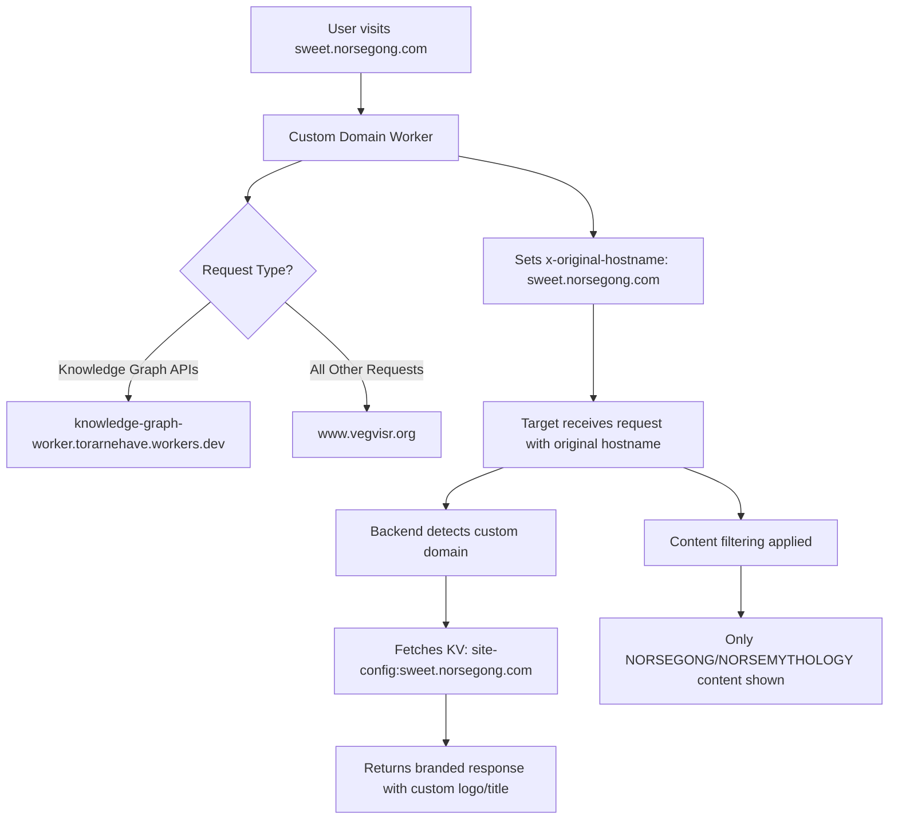

# Custom Domain & Branding System Architecture

## Overview

Vegvisr.org implements a sophisticated custom domain and branding system that allows users to create fully branded experiences on their own domains while leveraging the shared infrastructure. The system uses Cloudflare Workers, KV storage, and dynamic frontend configuration to provide seamless custom branding.

## 🏗️ System Architecture

### Core Components

1. **User Dashboard** - Branding configuration interface
2. **Main Worker** - Central API and data management
3. **Custom Domain Proxy Workers** - Domain-specific request routing
4. **KV Store** - Site configuration storage
5. **Frontend Composables** - Dynamic branding logic
6. **Content Filtering** - Domain-specific content restrictions

### Technology Stack

- **Frontend**: Vue.js 3 with Composition API
- **Backend**: Cloudflare Workers (JavaScript)
- **Storage**: Cloudflare KV + D1 Database
- **Proxy**: Cloudflare Workers with DNS routing
- **State Management**: Pinia stores

## 🎯 User Configuration Flow

### 1. User Interface (UserDashboard.vue)

Users configure their custom branding through the "Site Branding" section:

```vue
<!-- Site Branding Section - Lines 116-166 -->
<div class="mt-4" style="background: #f8f9fa; border-radius: 8px; padding: 1rem;">
  <h5 class="mb-3">Site Branding</h5>

  <!-- My Site -->
  <div class="mb-3">
    <label for="mySite" class="form-label"><strong>My Site:</strong></label>
    <input
      type="text"
      id="mySite"
      class="form-control"
      v-model="mySite"
      placeholder="e.g., sweet.norsegong.com"
    />
  </div>

  <!-- My Logo -->
  <div class="mb-3">
    <label for="myLogo" class="form-label"><strong>My Logo URL:</strong></label>
    <input
      type="url"
      id="myLogo"
      class="form-control"
      v-model="myLogo"
      placeholder="https://example.com/logo.png"
    />
  </div>
</div>
```

### 2. Data Structure

The branding data is stored in the following structure:

```javascript
const brandingData = {
  mySite: 'sweet.norsegong.com',
  myLogo: 'https://vegvisr.imgix.net/1750096799594.png',
}
```

## 💾 Data Storage System

### 1. Database Storage (main-worker/index.js)

When users save their branding settings, the data is stored in multiple locations:

```javascript
// User Profile Database (Lines 879-900)
const payload = {
  email: this.email,
  bio: this.bio,
  profileimage: this.profileImage,
  data: {
    profile: {
      user_id: this.userStore.user_id,
      email: this.email,
      mystmkraUserId: this.mystmkraUserId,
    },
    settings: {
      /* user settings */
    },
    branding: {
      mySite: this.mySite,
      myLogo: this.myLogo,
    },
  },
}
```

### 2. KV Store Configuration

Simultaneously, a site configuration is created in Cloudflare KV:

```javascript
// KV Store Entry Creation (main-worker/index.js)
if (data.branding && data.branding.mySite) {
  const siteConfig = {
    domain: data.branding.mySite, // "sweet.norsegong.com"
    owner: email, // "torarnehave@gmail.com"
    branding: data.branding, // { mySite, myLogo }
    contentFilter: {
      metaAreas:
        data.branding.mySite === 'sweet.norsegong.com' ? ['NORSEGONG', 'NORSEMYTHOLOGY'] : [],
    },
    updatedAt: new Date().toISOString(),
  }

  const kvKey = `site-config:${data.branding.mySite}`
  await env.SITE_CONFIGS.put(kvKey, JSON.stringify(siteConfig))
}
```

### 3. Example KV Store Entry

```json
{
  "key": "site-config:sweet.norsegong.com",
  "value": {
    "domain": "sweet.norsegong.com",
    "owner": "torarnehave@gmail.com",
    "branding": {
      "mySite": "sweet.norsegong.com",
      "myLogo": "https://vegvisr.imgix.net/1750096799594.png"
    },
    "contentFilter": {
      "metaAreas": ["NORSEGONG", "NORSEMYTHOLOGY"]
    },
    "updatedAt": "2025-06-16T19:12:11.551Z"
  }
}
```

## 🔄 Proxy Worker System

### 1. Custom Domain Worker

Each custom domain runs a dedicated Cloudflare Worker:

```javascript
// sweet.norsegong.com Worker - UPDATED VERSION
export default {
  async fetch(request, env, ctx) {
    const url = new URL(request.url)
    const hostname = url.hostname

    // Route determination - EXPANDED to handle more endpoints
    let targetUrl
    if (
      url.pathname.startsWith('/getknowgraphs') ||
      url.pathname.startsWith('/getknowgraph') ||
      url.pathname.startsWith('/saveknowgraph') ||
      url.pathname.startsWith('/updateknowgraph') ||
      url.pathname.startsWith('/deleteknowgraph') ||
      url.pathname.startsWith('/saveGraphWithHistory') // ADDED
    ) {
      // Knowledge graph APIs → specialized worker
      targetUrl =
        'https://knowledge-graph-worker.torarnehave.workers.dev' + url.pathname + url.search
    } else if (
      url.pathname.startsWith('/mystmkrasave') ||
      url.pathname.startsWith('/generate-header-image') ||
      url.pathname.startsWith('/grok-ask') ||
      url.pathname.startsWith('/grok-elaborate') ||
      url.pathname.startsWith('/apply-style-template') // ADDED API ENDPOINTS
    ) {
      // API endpoints → api worker
      targetUrl = 'https://api.vegvisr.org' + url.pathname + url.search
    } else {
      // Everything else → main vegvisr.org
      targetUrl = 'https://www.vegvisr.org' + url.pathname + url.search
    }

    // CRITICAL: Preserve original hostname
    const headers = new Headers(request.headers)
    headers.set('x-original-hostname', hostname)

    // Proxy the request
    const response = await fetch(targetUrl, {
      method: request.method,
      headers: headers,
      body: request.body,
      redirect: 'follow',
    })

    return new Response(response.body, response)
  },
}
```

### 2. Key Features

- **Simple Proxy**: Forwards all requests with minimal processing
- **Route-Based Targeting**: Different APIs can be routed to different workers
- **Hostname Preservation**: Critical `x-original-hostname` header
- **Transparent Operation**: Client doesn't know about the proxy

## 🎨 Frontend Branding Logic

### 1. Hostname Detection (useBranding.js)

The frontend automatically detects the custom domain:

```javascript
// Hostname Detection (Lines 12-28)
const detectHostname = async () => {
  try {
    const response = await fetch(window.location.href, { method: 'HEAD' })
    const originalHostname = response.headers.get('x-original-hostname')
    if (originalHostname) {
      console.log('Detected original hostname from proxy:', originalHostname)
      detectedHostname.value = originalHostname
      return originalHostname // "sweet.norsegong.com"
    }
  } catch (error) {
    console.log('Could not detect original hostname from headers:', error)
  }

  // Fallback to window location
  const hostname = window.location.hostname
  detectedHostname.value = hostname
  return hostname
}
```

### 2. Site Configuration Retrieval

Once hostname is detected, fetch the KV configuration:

```javascript
// Site Config Fetch (Lines 45-65)
const fetchSiteConfig = async (domain) => {
  if (!domain || loading.value) return

  loading.value = true
  try {
    console.log('Fetching site configuration for domain:', domain)
    const response = await fetch(apiUrls.getSiteConfig(domain))
    if (response.ok) {
      const config = await response.json()
      siteConfig.value = config
      console.log('Loaded site configuration for', domain, config)
    } else if (response.status === 404) {
      siteConfig.value = null
      console.log('No site configuration found for', domain)
    }
  } catch (error) {
    console.error('Error fetching site configuration:', error)
    siteConfig.value = null
  } finally {
    loading.value = false
  }
}
```

### 3. Dynamic Logo Display

Logo selection follows a priority hierarchy:

```javascript
// Logo Priority Logic (Lines 72-84)
const currentLogo = computed(() => {
  // 1. First check KV site configuration
  if (isCustomDomain.value && siteConfig.value?.branding?.myLogo) {
    console.log('Using logo from KV site config:', siteConfig.value.branding.myLogo)
    return siteConfig.value.branding.myLogo
  }

  // 2. Fallback to user store (for logged-in users)
  if (userStore.branding?.myLogo && userStore.branding?.mySite === currentDomain.value) {
    console.log('Using logo from user store:', userStore.branding.myLogo)
    return userStore.branding.myLogo
  }

  // 3. Default Vegvisr logo
  console.log('Using default Vegvisr logo')
  return 'https://vegvisr.imgix.net/vegvisr-logo.png'
})
```

### 4. Site Title Generation

Automatic title conversion from domain names:

```javascript
// Site Title Logic (Lines 86-104)
const currentSiteTitle = computed(() => {
  if (isCustomDomain.value && siteConfig.value?.branding?.mySite) {
    const domain = siteConfig.value.branding.mySite
    if (domain === 'sweet.norsegong.com') {
      return 'Sweet NorseGong' // Special case
    }
    // Generic conversion: "example.domain.com" → "Example"
    return domain.split('.')[0].charAt(0).toUpperCase() + domain.split('.')[0].slice(1)
  }

  // Fallback logic for user store
  if (userStore.branding?.mySite === currentDomain.value) {
    const domain = userStore.branding.mySite
    if (domain === 'sweet.norsegong.com') {
      return 'Sweet NorseGong'
    }
    return domain.split('.')[0].charAt(0).toUpperCase() + domain.split('.')[0].slice(1)
  }

  return 'Vegvisr' // Default
})
```

## 🔍 Content Filtering System

### 1. Dynamic Meta Area Selection

**NEW**: The branding modal now uses actual meta areas from the knowledge graph system instead of hardcoded categories:

```javascript
// BrandingModal.vue - Real Meta Areas Integration
computed: {
  availableCategories() {
    // Get meta areas from portfolio store and format them for the UI
    return this.portfolioStore.allMetaAreas.map(metaArea => ({
      value: metaArea,
      label: this.formatMetaAreaLabel(metaArea),
      description: `Content related to ${this.formatMetaAreaLabel(metaArea).toLowerCase()}`
    }))
  }
}
```

**Key Improvements:**

- Uses real meta areas extracted from existing knowledge graphs
- No more hardcoded category lists
- Dynamic updates as knowledge graphs are added/modified
- Formatted labels automatically generated from meta area names

### 2. Domain-Based Filtering

Custom domains can have content restrictions applied:

```javascript
// Content Filter Application (dev-worker)
const hostname = request.headers.get('x-original-hostname') || new URL(request.url).hostname
let allowedMetaAreas = null

if (hostname === 'sweet.norsegong.com') {
  allowedMetaAreas = ['NORSEGONG', 'NORSEMYTHOLOGY']
  console.log('Setting allowed meta areas for sweet.norsegong.com:', allowedMetaAreas)
} else {
  console.log('No filtering applied - hostname does not match sweet.norsegong.com')
}
```

### 2. Header-Based Filtering

The main proxy worker also sets filtering headers:

```javascript
// Header-Based Filtering (src/worker.js)
if (hostname === 'sweet.norsegong.com') {
  console.log('Setting NORSEGONG and NORSEMYTHOLOGY filter for sweet.norsegong.com')
  headers.set('x-meta-area-filter', 'NORSEGONG,NORSEMYTHOLOGY')
  headers.set('x-custom-meta-area-filter', 'NORSEGONG,NORSEMYTHOLOGY')
}
```

## 📊 Complete Request Flow



## 🛠️ Implementation Steps

### 1. User Configuration

1. User fills out branding form in UserDashboard.vue
2. Clicks "Save Changes"
3. Data stored in user profile database
4. KV entry created for site configuration

### 2. DNS & Worker Setup

1. DNS record points custom domain to Cloudflare Worker
2. Deploy custom domain worker with proxy logic
3. Worker preserves hostname in x-original-hostname header

### 3. Frontend Detection

1. useBranding.js detects custom domain from headers
2. Fetches site configuration from KV store
3. Applies custom logo and site title
4. Updates UI dynamically

### 4. Content Filtering

1. Backend workers receive x-original-hostname header
2. Apply domain-specific content filtering rules
3. Return filtered content appropriate for the domain

## 🎯 Key Benefits

### 1. **Scalability**

- New custom domains only need simple proxy workers
- All complex logic remains in shared infrastructure
- Easy to add new domains with minimal configuration

### 2. **Flexibility**

- Users can update branding instantly
- No code changes needed for new domains
- Supports both logos and content filtering

### 3. **Performance**

- KV store provides fast configuration lookup
- Cloudflare edge caching for optimal performance
- Minimal overhead from proxy workers

### 4. **Maintainability**

- Single codebase serves all domains
- Centralized configuration management
- Clear separation of concerns

## 🔧 Configuration Examples

### Domain: sweet.norsegong.com

- **Logo**: Custom Norse-themed logo
- **Title**: "Sweet NorseGong"
- **Content Filter**: NORSEGONG, NORSEMYTHOLOGY only
- **Theme**: Norse brown/gold color scheme

### Domain: example.customdomain.com

- **Logo**: User-provided logo URL
- **Title**: "Example" (auto-generated from domain)
- **Content Filter**: None (all content visible)
- **Theme**: Default Vegvisr theme

## 🚀 Future Enhancements

1. **Advanced Theming**: Custom CSS injection per domain
2. **Multi-Language Support**: Domain-specific language settings
3. **Analytics Integration**: Domain-specific tracking
4. **SEO Optimization**: Custom meta tags per domain
5. **Advanced Filtering**: Multiple filter criteria per domain

---

This architecture enables users to create fully branded, content-filtered experiences on their custom domains while leveraging the powerful shared Vegvisr infrastructure.
