# Email Template System Architecture

## Overview

The Email Template System is an AI-powered, interactive email template builder integrated into the Vegvisr Knowledge Graph platform. It allows users to create, customize, and generate professional email templates using AI assistance while maintaining full manual control over the content.

## System Architecture

```mermaid
graph TB
    subgraph "Frontend Layer"
        A[GNewEmailTemplateNode.vue] --> B[Template Builder UI]
        A --> C[AI Generator Panel]
        A --> D[Variable Manager]
        A --> E[Email Preview]
    end

    subgraph "API Layer"
        F[api-worker/index.js] --> G[/generateEmailTemplate]
        F --> H[/send-vegvisr-email]
    end

    subgraph "AI Services"
        I[OpenAI GPT-4] --> J[Template Generation]
        K[Anthropic Claude] --> L[Alternative AI Provider]
        M[XAI Grok] --> N[Creative Generation]
    end

    subgraph "Database Layer"
        O[graphTemplates Table] --> P[Template Storage]
        O --> Q[Template Metadata]
    end

    subgraph "Email Services"
        R[slowyou.io API] --> S[Email Delivery]
    end

    A --> F
    F --> I
    F --> O
    F --> R
```

## Component Architecture

### 1. Frontend Components

#### GNewEmailTemplateNode.vue

**Location**: `src/components/GNewNodes/GNewEmailTemplateNode.vue`

**Responsibilities**:

- Render email template builder interface
- Manage template state and variables
- Handle AI generation requests
- Provide real-time email preview
- Send test emails and save templates

**Key Features**:

- **Header Controls**: Expand/collapse, AI generator toggle, edit/delete
- **Template Configuration**: Name, subject, recipients setup
- **Email Body Editor**: Rich text area with variable support
- **Variables Manager**: Dynamic variable creation and editing
- **AI Generator Panel**: AI-powered template generation
- **Preview Panel**: Real-time email rendering
- **Actions**: Test email, save template, copy JSON

#### Node Registration

**Location**: `src/components/GNewNodes/GNewNodeRenderer.vue`

```javascript
'email-template': GNewEmailTemplateNode
```

### 2. Backend Services

#### API Worker

**Location**: `api-worker/index.js`

**New Endpoint**: `/generateEmailTemplate`

- **Method**: POST
- **Purpose**: AI-powered email template generation
- **Model**: GPT-4 (OpenAI)
- **Input**: Prompt, email type, tone, variables
- **Output**: Structured JSON template

**Existing Integration**: `/send-vegvisr-email` (slowyou.io)

### 3. Database Schema

#### graphTemplates Table

```sql
CREATE TABLE graphTemplates (
    id TEXT PRIMARY KEY,
    name TEXT NOT NULL,
    nodes TEXT NOT NULL,      -- JSON array of template nodes
    edges TEXT NOT NULL,      -- JSON array (empty for email templates)
    created_at DATETIME,
    updated_at DATETIME,
    ai_instructions TEXT,     -- AI usage guidance
    category TEXT,            -- 'Email Templates'
    thumbnail_path TEXT,
    standard_question TEXT
);
```

## Data Flow

### 1. Template Creation Flow

```mermaid
sequenceDiagram
    participant U as User
    participant C as Component
    participant A as API Worker
    participant AI as OpenAI GPT-4
    participant DB as Database

    U->>C: Click "🤖 AI" button
    C->>C: Show AI Generator Panel
    U->>C: Enter prompt and options
    C->>A: POST /generateEmailTemplate
    A->>AI: Generate template request
    AI->>A: Return structured JSON
    A->>C: Template data
    C->>C: Populate template fields
    U->>C: Review and adjust
    C->>DB: Save template
```



### 2. Email Sending Flow


## Template Data Structure

### Node Info Structure

```json
{
  "templateName": "Chat Invitation Template",
  "subject": "You are invited to join {roomName}",
  "body": "Hello!\n\n{senderName} has invited you to join...",
  "recipients": "{inviteeEmail}",
  "variables": {
    "roomName": "Demo Chat Room",
    "senderName": "John Doe",
    "inviteeEmail": "user@example.com"
  }
}
```

### Database Storage Format

```json
{
  "id": "email-template-chat-invitation",
  "type": "email-template",
  "label": "📧 Chat Invitation Email",
  "color": "#4CAF50",
  "info": "{stringified template data}",
  "bibl": [],
  "imageWidth": "100%",
  "imageHeight": "100%",
  "visible": true,
  "path": null
}
```

## AI Integration

### OpenAI Configuration

- **Model**: GPT-4
- **Max Tokens**: 1500
- **Temperature**: 0.7
- **System Prompt**: Specialized for email template generation

### AI Prompt Structure

```
You are an expert email template generator...

Always respond with a valid JSON object in this exact format:
{
  "templateName": "...",
  "subject": "...",
  "body": "...",
  "recipients": "...",
  "variables": {...}
}

Guidelines:
- Use {variableName} for placeholders
- Make the tone {specified_tone}
- Structure for {email_type} emails
```

### Supported AI Providers

1. **OpenAI** (Primary): GPT-4, GPT-3.5
2. **Anthropic** (Available): Claude models
3. **XAI** (Available): Grok models
4. **Google** (Available): Gemini models

## User Interface Features

### AI Generator Panel

- **Gradient Design**: Modern purple-blue gradient
- **Prompt Input**: Multi-line description field
- **Email Type Selector**: Invitation, notification, welcome, etc.
- **Tone Selector**: Professional, friendly, formal, casual, urgent
- **Variable Suggestions**: Optional comma-separated list
- **Generate Button**: Triggers AI generation
- **Clear Button**: Resets form
- **Status Messages**: Success/error feedback

### Template Builder

- **Expandable Interface**: Header click to expand/collapse
- **Live Preview**: Real-time email rendering
- **Variable Management**: Dynamic add/remove variables
- **Form Validation**: Required field checking
- **Copy to Clipboard**: JSON export functionality

## Security Considerations

### API Security

- **CORS Headers**: Configured for cross-origin requests
- **API Key Management**: Environment variables for AI services
- **Input Validation**: Prompt sanitization and length limits
- **Rate Limiting**: Managed by Cloudflare Workers

### Data Privacy

- **Template Storage**: User-specific template ownership
- **Variable Handling**: Client-side variable substitution
- **Email Content**: No persistent storage of email content

## Performance Optimizations

### Frontend Performance

- **Component Lazy Loading**: Dynamic imports
- **Reactive State Management**: Vue 3 Composition API
- **Efficient Re-rendering**: Computed properties for preview
- **Debounced Updates**: Reduced API calls

### Backend Performance

- **Cloudflare Workers**: Edge computing for low latency
- **AI Response Caching**: Potential for similar prompts
- **JSON Streaming**: Efficient data transfer
- **Error Recovery**: Robust fallback mechanisms

## Integration Points

### Knowledge Graph Integration

- **Node Type Registration**: Part of graph node ecosystem
- **Template Sharing**: Save to knowledge graph templates
- **Graph Embedding**: Templates as reusable graph components

### Email Service Integration

- **slowyou.io API**: Primary email delivery service
- **Template Variables**: Dynamic content substitution
- **Delivery Tracking**: Send confirmation and status

### Template System Integration

- **Category Management**: "Email Templates" category
- **Template Metadata**: AI instructions and standard questions
- **Template Discovery**: Search and filter capabilities

## Deployment Architecture

### Production Environment

```
Frontend (Vite) → CDN → Cloudflare Workers (API) → External Services
                                ↓
                        Database (SQLite/D1)
```

### Development Environment

```
Local Vite Dev Server → Local API Worker → AI Services
                              ↓
                      Local Database
```

## Future Enhancements

### Planned Features

1. **Template Versioning**: Track template changes over time
2. **Collaborative Editing**: Multi-user template creation
3. **Advanced AI Options**: Custom model selection per template
4. **Email Analytics**: Open rates and engagement tracking
5. **Template Marketplace**: Share templates with community

### Technical Improvements

1. **Real-time Collaboration**: WebSocket integration
2. **Advanced Preview**: Mobile/desktop email previews
3. **Template Testing**: A/B testing capabilities
4. **Performance Monitoring**: Template generation metrics
5. **Enhanced Security**: Template access controls

## Troubleshooting Guide

### Common Issues

1. **AI Generation Fails**: Check API keys and rate limits
2. **Template Not Saving**: Verify database permissions
3. **Email Not Sending**: Check slowyou.io integration
4. **Variables Not Working**: Validate JSON structure

### Debug Information

- **Browser Console**: Component state and API responses
- **Network Tab**: API request/response details
- **Worker Logs**: Cloudflare Workers debugging
- **Database Queries**: SQL execution logs

## API Reference

### Generate Email Template

```http
POST /generateEmailTemplate
Content-Type: application/json

{
  "prompt": "Create a professional project update email...",
  "emailType": "update",
  "tone": "professional"
}
```

**Response**:

```json
{
  "success": true,
  "template": {
    "templateName": "Weekly Project Update",
    "subject": "Project Update: {projectName}",
    "body": "Hi {recipientName}...",
    "recipients": "{teamEmail}",
    "variables": {...}
  }
}
```

---

_Last Updated: July 29, 2025_
_Version: 1.0_
