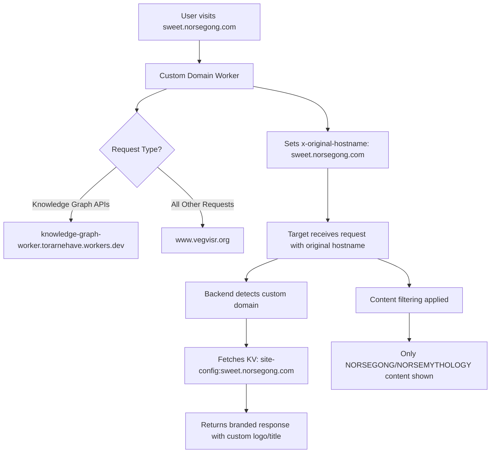

# Custom Domain & Branding System Architecture

## Overview

Vegvisr.org implements a sophisticated custom domain and branding system that allows users to create fully branded experiences on their own domains while leveraging the shared infrastructure. The system uses Cloudflare Workers, KV storage, and dynamic frontend configuration to provide seamless custom branding.

## 🏗️ System Architecture

### Core Components

1. **User Dashboard** - Branding configuration interface
2. **Main Worker** - Central API and data management
3. **Custom Domain Proxy Workers** - Domain-specific request routing
4. **KV Store** - Site configuration storage
5. **Frontend Composables** - Dynamic branding logic
6. **Content Filtering** - Domain-specific content restrictions

### Technology Stack

- **Frontend**: Vue.js 3 with Composition API
- **Backend**: Cloudflare Workers (JavaScript)
- **Storage**: Cloudflare KV + D1 Database
- **Proxy**: Cloudflare Workers with DNS routing
- **State Management**: Pinia stores

## 🎯 User Configuration Flow

### 1. User Interface (UserDashboard.vue & BrandingModal.vue)

**Update (2024-06):**

- The Custom Domain Branding section is now visible to all users by default (for testing and ease of access).
- The dashboard always displays the "Custom Domain Branding" card and the "Manage Domains" button, regardless of user role.
- Any user can open the `BrandingModal.vue` modal to manage/add domains, logos, and content filtering.
- The modal supports managing multiple domains, allowing users to add, edit, and remove configurations with a user-friendly interface.
- Features include live previews of branding, validation for domain and logo inputs, and deployment assistance.
- **Meta Area Filtering in Portfolio**: The `GraphPortfolio.vue` component includes a `MetaAreaSidebar` for users to filter knowledge graphs by specific Meta Areas, enhancing content navigation and discovery.
- (Optional) The admin-only restriction can be restored by re-adding the `v-if="isAdminOrSuperadmin"` condition in the template.

```vue
<!-- Custom Domain Branding Section - Always Visible -->
<div class="mt-4">
  <div class="branding-card"> ... </div>
</div>
```

### 2. Multi-Domain Management

- **Feature**: Users can configure multiple custom domains, each with unique branding and content filtering settings.
- **Implementation**: The `BrandingModal.vue` provides a list view to see all configured domains and a form view to add or edit domain details, including domain name, logo URL, and content filters.
- **User Experience**: Options to remove domains and save all configurations at once, with backward compatibility for legacy branding data.

### 3. Data Structure

The branding data is stored in the following structure:

```javascript
const brandingData = {
  mySite: 'sweet.norsegong.com',
  myLogo: 'https://vegvisr.imgix.net/1750096799594.png',
}
```

## 💾 Data Storage System

### 1. Database Storage (main-worker/index.js)

When users save their branding settings, the data is stored in multiple locations:

```javascript
// User Profile Database (Lines 879-900)
const payload = {
  email: this.email,
  bio: this.bio,
  profileimage: this.profileImage,
  data: {
    profile: {
      user_id: this.userStore.user_id,
      email: this.email,
      mystmkraUserId: this.mystmkraUserId,
    },
    settings: {
      /* user settings */
    },
    branding: {
      mySite: this.mySite,
      myLogo: this.myLogo,
      mySiteFrontPage: this.mySiteFrontPage, // New field for custom front page
    },
  },
}
```

### 2. KV Store Configuration

Simultaneously, a site configuration is created in Cloudflare KV:

```javascript
// KV Store Entry Creation (main-worker/index.js)
if (data.domainConfigs && Array.isArray(data.domainConfigs)) {
  // New multi-domain structure
  console.log('Processing multi-domain configurations:', data.domainConfigs.length, 'domains')

  for (const domainConfig of data.domainConfigs) {
    try {
      // Determine metaAreas based on domain's content filter selection
      let metaAreas = []
      if (domainConfig.contentFilter === 'custom' && domainConfig.selectedCategories) {
        metaAreas = domainConfig.selectedCategories
        console.log(`Domain ${domainConfig.domain}: Using selected meta areas:`, metaAreas)
      } else if (domainConfig.contentFilter === 'none') {
        metaAreas = []
        console.log(`Domain ${domainConfig.domain}: No content filtering`)
      }

      const siteConfig = {
        domain: domainConfig.domain,
        owner: email,
        branding: {
          mySite: domainConfig.domain,
          myLogo: domainConfig.logo,
          contentFilter: domainConfig.contentFilter,
          selectedCategories: domainConfig.selectedCategories,
          mySiteFrontPage: domainConfig.mySiteFrontPage, // New field for custom front page
        },
        contentFilter: {
          metaAreas: metaAreas,
        },
        updatedAt: new Date().toISOString(),
      }

      const kvKey = `site-config:${domainConfig.domain}`
      await env.SITE_CONFIGS.put(kvKey, JSON.stringify(siteConfig))
      console.log(`Saved domain config to KV: ${kvKey} with ${metaAreas.length} meta areas`)
    } catch (kvError) {
      console.error(`Error saving domain config for ${domainConfig.domain}:`, kvError)
      // Continue with other domains even if one fails
    }
  }
} else if (data.branding && data.branding.mySite) {
  // Legacy single domain support
  const siteConfig = {
    domain: data.branding.mySite, // "sweet.norsegong.com"
    owner: email, // "torarnehave@gmail.com"
    branding: data.branding, // { mySite, myLogo, mySiteFrontPage }
    contentFilter: {
      metaAreas:
        data.branding.contentFilter === 'custom' && data.branding.selectedCategories
          ? data.branding.selectedCategories
          : data.branding.mySite === 'sweet.norsegong.com'
            ? ['NORSEGONG', 'NORSEMYTHOLOGY']
            : [],
    },
    updatedAt: new Date().toISOString(),
  }

  const kvKey = `site-config:${data.branding.mySite}`
  await env.SITE_CONFIGS.put(kvKey, JSON.stringify(siteConfig))
}
```

**Note**: The system now supports multiple domain configurations through the `domainConfigs` array, allowing users to manage several branded domains in KV storage. Legacy single-domain support is maintained for backward compatibility. A new field `mySiteFrontPage` has been added to store the preferred startup page for each custom domain.

### 3. Example KV Store Entry

```json
{
  "key": "site-config:vegvisr.norsegong.com",
  "value": {
    "domain": "vegvisr.norsegong.com",
    "owner": "torarnehave@gmail.com",
    "branding": {
      "mySite": "vegvisr.norsegong.com",
      "myLogo": "https://vegvisr.imgix.net/1743603973605.png",
      "contentFilter": "none",
      "selectedCategories": [],
      "mySiteFrontPage": "/graph-viewer?graphId=123&template=Frontpage"
    },
    "contentFilter": {
      "metaAreas": []
    },
    "updatedAt": "2025-06-17T16:49:27.318Z"
  }
}
```

## 🔄 Proxy Worker System

### 1. Custom Domain Worker

Each custom domain runs a dedicated Cloudflare Worker:

```javascript
// sweet.norsegong.com Worker - UPDATED VERSION
export default {
  async fetch(request, env, ctx) {
    const url = new URL(request.url)
    const hostname = url.hostname

    // Route determination - EXPANDED to handle more endpoints
    let targetUrl
    if (
      url.pathname.startsWith('/getknowgraphs') ||
      url.pathname.startsWith('/getknowgraph') ||
      url.pathname.startsWith('/saveknowgraph') ||
      url.pathname.startsWith('/updateknowgraph') ||
      url.pathname.startsWith('/deleteknowgraph') ||
      url.pathname.startsWith('/saveGraphWithHistory') // ADDED
    ) {
      // Knowledge graph APIs → specialized worker
      targetUrl =
        'https://knowledge-graph-worker.torarnehave.workers.dev' + url.pathname + url.search
    } else if (
      url.pathname.startsWith('/mystmkrasave') ||
      url.pathname.startsWith('/generate-header-image') ||
      url.pathname.startsWith('/grok-ask') ||
      url.pathname.startsWith('/grok-elaborate') ||
      url.pathname.startsWith('/apply-style-template') // ADDED API ENDPOINTS
    ) {
      // API endpoints → api worker
      targetUrl = 'https://api.vegvisr.org' + url.pathname + url.search
    } else {
      // Everything else → main vegvisr.org
      targetUrl = 'https://www.vegvisr.org' + url.pathname + url.search
    }

    // CRITICAL: Preserve original hostname
    const headers = new Headers(request.headers)
    headers.set('x-original-hostname', hostname)

    // Proxy the request
    const response = await fetch(targetUrl, {
      method: request.method,
      headers: headers,
      body: request.body,
      redirect: 'follow',
    })

    return new Response(response.body, response)
  },
}
```

### 2. Automated Setup

- **API Automation**: The setup of DNS records and worker routes for custom domains can be automated via the `/createCustomDomain` endpoint in `api-worker/index.js`. This endpoint creates a CNAME record pointing to `brand-worker.torarnehave.workers.dev` and sets up a route to direct traffic to the `brand-worker` script, specifically for subdomains under `norsegong.com`.

### 3. Key Features

- **Simple Proxy**: Forwards all requests with minimal processing
- **Route-Based Targeting**: Different APIs can be routed to different workers
- **Hostname Preservation**: Critical `x-original-hostname` header
- **Transparent Operation**: Client doesn't know about the proxy

## 🎨 Frontend Branding Logic

### 1. Hostname Detection (useBranding.js)

The frontend automatically detects the custom domain:

```javascript
// Hostname Detection (Lines 12-28)
const detectHostname = async () => {
  try {
    const response = await fetch(window.location.href, { method: 'HEAD' })
    const originalHostname = response.headers.get('x-original-hostname')
    if (originalHostname) {
      console.log('Detected original hostname from proxy:', originalHostname)
      detectedHostname.value = originalHostname
      return originalHostname // "sweet.norsegong.com"
    }
  } catch (error) {
    console.log('Could not detect original hostname from headers:', error)
  }

  // Fallback to window location
  const hostname = window.location.hostname
  detectedHostname.value = hostname
  return hostname
}
```

### 2. Site Configuration Retrieval

Once hostname is detected, fetch the KV configuration:

```javascript
// Site Config Fetch (Lines 45-65)
const fetchSiteConfig = async (domain) => {
  if (!domain || loading.value) return

  loading.value = true
  try {
    console.log('Fetching site configuration for domain:', domain)
    const response = await fetch(apiUrls.getSiteConfig(domain))
    if (response.ok) {
      const config = await response.json()
      siteConfig.value = config
      console.log('Loaded site configuration for', domain, config)
    } else if (response.status === 404) {
      siteConfig.value = null
      console.log('No site configuration found for', domain)
    }
  } catch (error) {
    console.error('Error fetching site configuration:', error)
    siteConfig.value = null
  } finally {
    loading.value = false
  }
}
```

### 3. Dynamic Logo Display

Logo selection follows a priority hierarchy:

```javascript
// Logo Priority Logic (Lines 72-84)
const currentLogo = computed(() => {
  // 1. First check KV site configuration
  if (isCustomDomain.value && siteConfig.value?.branding?.myLogo) {
    console.log('Using logo from KV site config:', siteConfig.value.branding.myLogo)
    return siteConfig.value.branding.myLogo
  }

  // 2. Fallback to user store (for logged-in users)
  if (userStore.branding?.myLogo && userStore.branding?.mySite === currentDomain.value) {
    console.log('Using logo from user store:', userStore.branding.myLogo)
    return userStore.branding.myLogo
  }

  // 3. Default Vegvisr logo
  console.log('Using default Vegvisr logo')
  return 'https://vegvisr.imgix.net/vegvisr-logo.png'
})
```

### 4. Site Title Generation

Automatic title conversion from domain names:

```javascript
// Site Title Logic (Lines 86-104)
const currentSiteTitle = computed(() => {
  if (isCustomDomain.value && siteConfig.value?.branding?.mySite) {
    const domain = siteConfig.value.branding.mySite
    if (domain === 'sweet.norsegong.com') {
      return 'Sweet NorseGong' // Special case
    }
    // Generic conversion: "example.domain.com" → "Example"
    return domain.split('.')[0].charAt(0).toUpperCase() + domain.split('.')[0].slice(1)
  }

  // Fallback logic for user store
  if (userStore.branding?.mySite === currentDomain.value) {
    const domain = userStore.branding.mySite
    if (domain === 'sweet.norsegong.com') {
      return 'Sweet NorseGong'
    }
    return domain.split('.')[0].charAt(0).toUpperCase() + domain.split('.')[0].slice(1)
  }

  return 'Vegvisr' // Default
})
```

### 5. Live Preview in Branding Modal

- **Feature**: The `BrandingModal.vue` includes a live preview of the branding setup, displaying a browser mockup with the custom domain, logo, and generated site title.
- **Purpose**: Allows users to see how their branded site will appear before saving or deploying, enhancing user experience and decision-making.

### 6. Custom Front Page Redirection

- **Feature**: A new field `mySiteFrontPage` in the branding configuration allows users to specify a custom startup page for their domain (e.g., `/graph-viewer?graphId=123&template=Frontpage`).
- **Logic**: When a user accesses the root of a custom domain, the frontend checks `siteConfig.value?.branding?.mySiteFrontPage`. If defined, it redirects to the specified path or dynamically loads the content.
- **Fallback**: If no custom front page is set, the default landing page for Vegvisr is shown.
- **Implementation in GraphViewer.vue**: It is recommended to use `GraphViewer.vue` to display the front page content for custom domains. This component can be modified to automatically load a specific knowledge graph based on the `mySiteFrontPage` setting when a user accesses the root of a custom domain. This approach leverages existing functionality for graph display and maintains user experience consistency.

```javascript
// Front Page Redirection Logic (useBranding.js)
const currentFrontPage = computed(() => {
  if (isCustomDomain.value && siteConfig.value?.branding?.mySiteFrontPage) {
    console.log(
      'Using custom front page from KV site config:',
      siteConfig.value.branding.mySiteFrontPage,
    )
    return siteConfig.value.branding.mySiteFrontPage
  }
  if (userStore.branding?.mySiteFrontPage && userStore.branding?.mySite === currentDomain.value) {
    console.log('Using custom front page from user store:', userStore.branding.mySiteFrontPage)
    return userStore.branding.mySiteFrontPage
  }
  console.log('Using default front page')
  return '/' // Default landing page
})
```

```javascript
// Dynamic Graph Loading in GraphViewer.vue
onMounted(() => {
  const frontPagePath = currentFrontPage.value
  if (frontPagePath && frontPagePath.includes('graphId')) {
    const params = new URLSearchParams(frontPagePath.split('?')[1] || '')
    const graphId = params.get('graphId')
    const template = params.get('template')
    if (graphId) {
      console.log(
        `Loading front page graph with ID: ${graphId}, Template: ${template || 'Default'}`,
      )
      loadGraph(graphId, template)
    }
  }
})
```

## 🔍 Content Filtering System

### 1. Dynamic Meta Area Selection

**NEW**: The branding modal now uses actual meta areas from the knowledge graph system instead of hardcoded categories:

```javascript
// BrandingModal.vue - Real Meta Areas Integration
computed: {
  availableCategories() {
    // Get meta areas from portfolio store and format them for the UI
    return this.portfolioStore.allMetaAreas.map(metaArea => ({
      value: metaArea,
      label: this.formatMetaAreaLabel(metaArea),
      description: `Content related to ${this.formatMetaAreaLabel(metaArea).toLowerCase()}`
    }))
  }
}
```

**Key Improvements:**

- Uses real meta areas extracted from existing knowledge graphs
- No more hardcoded category lists
- Dynamic updates as knowledge graphs are added/modified
- Formatted labels automatically generated from meta area names
- **API-Driven Meta Area Generation**: Superadmin users can auto-generate Meta Areas using the `/generate-meta-areas` endpoint, allowing AI (GROK AI) to suggest relevant Meta Areas based on existing content.
- **Reset Functionality**: Superadmins can reset all Meta Areas to default or clear existing configurations via the `resetMetaAreas` API call.
- **Autocomplete Feature**: During graph metadata editing in `GraphPortfolio.vue`, an autocomplete feature suggests Meta Areas as users type, pulling from the full list in `portfolioStore.allMetaAreas`.

### 2. Domain-Based Filtering

Custom domains can have content restrictions applied:

```javascript
// Content Filter Application (main-worker/index.js)
// Determine metaAreas based on domain's content filter selection
let metaAreas = []
if (domainConfig.contentFilter === 'custom' && domainConfig.selectedCategories) {
  metaAreas = domainConfig.selectedCategories
  console.log(`Domain ${domainConfig.domain}: Using selected meta areas:`, metaAreas)
} else if (domainConfig.contentFilter === 'none') {
  metaAreas = []
  console.log(`Domain ${domainConfig.domain}: No content filtering`)
}
```

### 3. Header-Based Filtering

The main proxy worker also sets filtering headers:

```javascript
// Header-Based Filtering (src/worker.js)
if (hostname === 'sweet.norsegong.com') {
  console.log('Setting NORSEGONG and NORSEMYTHOLOGY filter for sweet.norsegong.com')
  headers.set('x-meta-area-filter', 'NORSEGONG,NORSEMYTHOLOGY')
  headers.set('x-custom-meta-area-filter', 'NORSEGONG,NORSEMYTHOLOGY')
}
```

## 📊 Complete Request Flow



## 🛡️ Access Control (NEW)

- **Current State:** The Custom Domain Branding section is visible to all users for testing and demonstration purposes.
- **Original Design:** Previously, only users with the `admin` or `superadmin` role could see and use the branding management UI.
- **How to Restrict Again:** To restore admin-only access, simply add back the following condition in `UserDashboard.vue`:
  ```vue
  <div v-if="isAdminOrSuperadmin" class="mt-4">
    ...
  </div>
  ```
- **Recommendation:** For production, restrict branding management to trusted users (admins/superadmins) to prevent abuse.

## 🛠️ Implementation Steps

### 1. User Configuration

1. User fills out branding form in UserDashboard.vue
2. Clicks "Save Changes"
3. Data stored in user profile database
4. KV entry created for site configuration

### 2. DNS & Worker Setup

1. DNS record points custom domain to Cloudflare Worker
2. Deploy custom domain worker with proxy logic
3. Worker preserves hostname in x-original-hostname header

### 3. Automated Custom Domain Setup via API

1. **API Endpoint**: The `/createCustomDomain` endpoint in `api-worker/index.js` automates the creation of DNS records and worker routes.
2. **Process**:
   - User or system sends a POST request with a subdomain (e.g., `subdomain.norsegong.com`).
   - The API creates a CNAME DNS record pointing to `brand-worker.torarnehave.workers.dev` with Cloudflare proxying enabled.
   - A worker route is set up for `${subdomain}.norsegong.com/*` to direct traffic to the `brand-worker` script.
3. **Environment Variables**: Uses `CF_ZONE_ID` and `CF_API_TOKEN` for Cloudflare API authentication.
4. **Domain Specificity**: Currently tailored for subdomains under `norsegong.com`.

### 4. Deployment Assistance via Branding Modal

1. **Quick Deployment Guide**: The `BrandingModal.vue` offers a guide for setting up custom domains, including copying pre-generated Cloudflare Worker code for proxy setup.
2. **Domain Testing**: Users can test domain setup directly from the modal by triggering a request to the `/create-custom-domain` endpoint, which checks DNS and worker route configuration.
3. **Feedback**: Provides immediate feedback on the success or failure of the domain setup process.

### 5. Frontend Detection

1. useBranding.js detects custom domain from headers
2. Fetches site configuration from KV store
3. Applies custom logo and site title
4. Updates UI dynamically

### 6. Content Filtering

1. Backend workers receive x-original-hostname header
2. Apply domain-specific content filtering rules
3. Return filtered content appropriate for the domain

### 7. Custom Front Page Configuration

1. **Form Field in Branding Modal**: The `BrandingModal.vue` component includes a form field or selection mechanism for users to set their preferred front page for each custom domain.
2. **Knowledge Graph ID Input**: Users can input a Knowledge Graph ID to specify a particular graph to be used as the front page (e.g., `/graph-viewer?graphId=123&template=Frontpage`). Alternatively, a dropdown or search interface can list available graphs from the user's portfolio for selection.
3. **Saving Configuration**: Upon saving, the selected front page path or ID is stored in the `mySiteFrontPage` field of the branding configuration in both the user profile database and KV store.

```vue
<!-- Example Form Field in BrandingModal.vue -->
<div class="mb-3">
  <label for="frontPage" class="form-label">Custom Front Page (Knowledge Graph ID)</label>
  <div class="input-group">
    <input type="text" class="form-control" id="frontPage" v-model="branding.mySiteFrontPage" placeholder="Enter Graph ID or Path (e.g., /graph-viewer?graphId=123&template=Frontpage)">
    <button class="btn btn-outline-secondary dropdown-toggle" type="button" data-bs-toggle="dropdown" aria-expanded="false">Select Graph</button>
    <ul class="dropdown-menu dropdown-menu-end">
      <li v-for="graph in userGraphs" :key="graph.id" @click="selectFrontPage(graph)">
        <a class="dropdown-item" href="#">{{ graph.title }} (ID: {{ graph.id }})</a>
      </li>
    </ul>
  </div>
</div>
```

### 8. Implementation of Custom Front Page Redirection

To implement the custom front page redirection for custom domains using `GraphViewer.vue`, follow these detailed steps:

#### Step 1: Update Data Storage in `main-worker/index.js`

- **Objective**: Ensure the `mySiteFrontPage` field is saved in both the user profile database and KV store.
- **Action**: Modify the payload and KV store entry creation to include `mySiteFrontPage`.

```javascript
// User Profile Database Update
const payload = {
  email: this.email,
  bio: this.bio,
  profileimage: this.profileImage,
  data: {
    profile: {
      user_id: this.userStore.user_id,
      email: this.email,
      mystmkraUserId: this.mystmkraUserId,
    },
    settings: {
      /* user settings */
    },
    branding: {
      mySite: this.mySite,
      myLogo: this.myLogo,
      mySiteFrontPage: this.mySiteFrontPage, // Include custom front page
    },
  },
}

// KV Store Entry Creation Update
if (data.domainConfigs && Array.isArray(data.domainConfigs)) {
  for (const domainConfig of data.domainConfigs) {
    const siteConfig = {
      domain: domainConfig.domain,
      owner: email,
      branding: {
        mySite: domainConfig.domain,
        myLogo: domainConfig.logo,
        contentFilter: domainConfig.contentFilter,
        selectedCategories: domainConfig.selectedCategories,
        mySiteFrontPage: domainConfig.mySiteFrontPage, // Include custom front page
      },
      contentFilter: {
        metaAreas: metaAreas,
      },
      updatedAt: new Date().toISOString(),
    }
    // Save to KV
    const kvKey = `site-config:${domainConfig.domain}`
    await env.SITE_CONFIGS.put(kvKey, JSON.stringify(siteConfig))
  }
} else if (data.branding && data.branding.mySite) {
  const siteConfig = {
    domain: data.branding.mySite,
    owner: email,
    branding: {
      mySite: data.branding.mySite,
      myLogo: data.branding.myLogo,
      mySiteFrontPage: data.branding.mySiteFrontPage, // Include custom front page
    },
    contentFilter: {
      metaAreas: // existing logic
    },
    updatedAt: new Date().toISOString(),
  }
  const kvKey = `site-config:${data.branding.mySite}`
  await env.SITE_CONFIGS.put(kvKey, JSON.stringify(siteConfig))
}
```

#### Step 2: Enhance `useBranding.js` for Front Page Detection

- **Objective**: Add logic to detect and return the custom front page path.
- **Action**: Update the composable to compute the current front page based on KV or user store data.

```javascript
// In useBranding.js
const currentFrontPage = computed(() => {
  if (isCustomDomain.value && siteConfig.value?.branding?.mySiteFrontPage) {
    console.log(
      'Using custom front page from KV site config:',
      siteConfig.value.branding.mySiteFrontPage,
    )
    return siteConfig.value.branding.mySiteFrontPage
  }
  if (userStore.branding?.mySiteFrontPage && userStore.branding?.mySite === currentDomain.value) {
    console.log('Using custom front page from user store:', userStore.branding.mySiteFrontPage)
    return userStore.branding.mySiteFrontPage
  }
  console.log('Using default front page')
  return '/' // Default landing page
})
```

#### Step 3: Modify `BrandingModal.vue` for Front Page Configuration

- **Objective**: Add a UI element for users to set their preferred front page.
- **Action**: Implement a form field and selection dropdown for choosing a knowledge graph.

```vue
<!-- In BrandingModal.vue -->
<template>
  <div>
    <!-- Existing branding fields -->
    <div class="mb-3">
      <label for="mySite" class="form-label">Custom Domain</label>
      <input
        type="text"
        class="form-control"
        id="mySite"
        v-model="branding.mySite"
        placeholder="e.g., mysite.norsegong.com"
      />
    </div>
    <div class="mb-3">
      <label for="myLogo" class="form-label">Logo URL</label>
      <input
        type="text"
        class="form-control"
        id="myLogo"
        v-model="branding.myLogo"
        placeholder="e.g., https://example.com/logo.png"
      />
    </div>
    <!-- New front page field -->
    <div class="mb-3">
      <label for="frontPage" class="form-label">Custom Front Page (Knowledge Graph ID)</label>
      <div class="input-group">
        <input
          type="text"
          class="form-control"
          id="frontPage"
          v-model="branding.mySiteFrontPage"
          placeholder="Enter Graph ID or Path (e.g., /graph-viewer?graphId=123&template=Frontpage)"
        />
        <button
          class="btn btn-outline-secondary dropdown-toggle"
          type="button"
          data-bs-toggle="dropdown"
          aria-expanded="false"
        >
          Select Graph
        </button>
        <ul class="dropdown-menu dropdown-menu-end">
          <li v-for="graph in userGraphs" :key="graph.id" @click="selectFrontPage(graph)">
            <a class="dropdown-item" href="#">{{ graph.title }} (ID: {{ graph.id }})</a>
          </li>
        </ul>
      </div>
    </div>
    <!-- Save button -->
    <button class="btn btn-primary" @click="saveBranding">Save Changes</button>
  </div>
</template>

<script setup>
import { ref, onMounted } from 'vue'
import { usePortfolioStore } from '@/stores/portfolioStore'

const branding = ref({
  mySite: '',
  myLogo: '',
  mySiteFrontPage: '',
})
const userGraphs = ref([])
const portfolioStore = usePortfolioStore()

onMounted(async () => {
  // Load user's graphs for selection
  await loadUserGraphs()
})

const loadUserGraphs = async () => {
  try {
    const graphs = await portfolioStore.fetchGraphs()
    userGraphs.value = graphs
  } catch (error) {
    console.error('Error loading user graphs:', error)
  }
}

const selectFrontPage = (graph) => {
  branding.value.mySiteFrontPage = `/graph-viewer?graphId=${graph.id}&template=Frontpage`
}

const saveBranding = async () => {
  // Save branding including mySiteFrontPage to user store and KV
  // Implementation depends on existing save logic
  console.log('Saving branding:', branding.value)
  // Call API or store update here
}
</script>
```

#### Step 4: Update `GraphViewer.vue` for Dynamic Graph Loading

- **Objective**: Load a specific graph based on `mySiteFrontPage` when accessed as the front page.
- **Action**: Add logic to parse the front page path and load the graph on component mount.

```vue
<!-- In GraphViewer.vue -->
<template>
  <div>
    <!-- Existing graph viewer template -->
    <div v-if="loading">Loading graph...</div>
    <div v-else-if="error">Error: {{ error }}</div>
    <div v-else>
      <!-- Display graph -->
      <h1>{{ graphTitle }}</h1>
      <!-- Graph rendering logic -->
    </div>
  </div>
</template>

<script setup>
import { ref, onMounted } from 'vue'
import { useBranding } from '@/composables/useBranding'
import { useKnowledgeGraphStore } from '@/stores/knowledgeGraphStore'

const { currentFrontPage } = useBranding()
const graphStore = useKnowledgeGraphStore()
const loading = ref(false)
const error = ref(null)
const graphTitle = ref('')

onMounted(() => {
  const frontPagePath = currentFrontPage.value
  if (frontPagePath && frontPagePath.includes('graphId')) {
    const params = new URLSearchParams(frontPagePath.split('?')[1] || '')
    const graphId = params.get('graphId')
    const template = params.get('template')
    if (graphId) {
      console.log(
        `Loading front page graph with ID: ${graphId}, Template: ${template || 'Default'}`,
      )
      loadGraph(graphId, template)
    } else {
      error.value = 'Invalid front page configuration: No graph ID found'
    }
  } else {
    // Default graph loading logic if not a front page
    loadDefaultGraph()
  }
})

const loadGraph = async (graphId, template) => {
  loading.value = true
  error.value = null
  try {
    await graphStore.loadGraph(graphId)
    graphTitle.value = graphStore.currentGraph?.metadata?.title || 'Untitled Graph'
    // Apply template-specific styling if needed
    if (template === 'Frontpage') {
      console.log('Applying Frontpage template styling')
      // Add any specific styling or layout adjustments for front page
    }
  } catch (err) {
    error.value = `Failed to load graph: ${err.message}`
    console.error('Error loading graph:', err)
  } finally {
    loading.value = false
  }
}

const loadDefaultGraph = async () => {
  // Existing logic to load a default or selected graph
  console.log('Loading default graph')
  // Implementation depends on current GraphViewer setup
}
</script>
```

#### Step 5: Adjust Proxy Logic in `brand-worker/index.js`

- **Objective**: Redirect root requests to the custom front page if defined.
- **Action**: Add logic to check KV store for `mySiteFrontPage` on root path requests.

```javascript
// In brand-worker/index.js
export default {
  async fetch(request, env) {
    const url = new URL(request.url)

    // Check if request is to the root path
    if (url.pathname === '/' || url.pathname === '') {
      // Get the hostname
      const hostname = url.hostname
      // Check KV for site configuration
      const kvKey = `site-config:${hostname}`
      try {
        const siteConfigJson = await env.SITE_CONFIGS.get(kvKey)
        if (siteConfigJson) {
          const siteConfig = JSON.parse(siteConfigJson)
          if (siteConfig.branding && siteConfig.branding.mySiteFrontPage) {
            // Redirect to the custom front page
            const frontPagePath = siteConfig.branding.mySiteFrontPage
            console.log(`Redirecting to custom front page: ${frontPagePath}`)
            return Response.redirect(`https://${hostname}${frontPagePath}`, 302)
          }
        }
      } catch (error) {
        console.error(`Error checking KV for front page: ${error.message}`)
        // Continue with default routing if error occurs
      }
    }

    // Existing proxy logic for other paths
    try {
      let targetUrl
      if (
        url.pathname.startsWith('/getknowgraphs') ||
        // other conditions
      ) {
        targetUrl = 'https://knowledge-graph-worker.torarnehave.workers.dev' + url.pathname + url.search
      } else if (
        url.pathname.startsWith('/mystmkrasave') ||
        // other conditions
      ) {
        targetUrl = 'https://api.vegvisr.org' + url.pathname + url.search
      } else {
        targetUrl = 'https://www.vegvisr.org' + url.pathname + url.search
      }

      const headers = new Headers(request.headers)
      headers.set('x-original-hostname', url.hostname)

      // Rest of the existing fetch logic
    } catch (error) {
      // Existing error handling
    }
  }
}
```

## 🎯 Key Benefits

### 1. **Scalability**

- New custom domains only need simple proxy workers
- All complex logic remains in shared infrastructure
- Easy to add new domains with minimal configuration

### 2. **Flexibility**

- Users can update branding instantly
- No code changes needed for new domains
- Supports both logos and content filtering

### 3. **Performance**

- KV store provides fast configuration lookup
- Cloudflare edge caching for optimal performance
- Minimal overhead from proxy workers

### 4. **Maintainability**

- Single codebase serves all domains
- Centralized configuration management
- Clear separation of concerns

## 🔧 Configuration Examples

### Domain: sweet.norsegong.com

- **Logo**: Custom Norse-themed logo
- **Title**: "Sweet NorseGong"
- **Content Filter**: NORSEGONG, NORSEMYTHOLOGY only
- **Theme**: Norse brown/gold color scheme

### Domain: example.customdomain.com

- **Logo**: User-provided logo URL
- **Title**: "Example" (auto-generated from domain)
- **Content Filter**: None (all content visible)
- **Theme**: Default Vegvisr theme

## 🚀 Future Enhancements

1. **Advanced Theming**: Custom CSS injection per domain
2. **Multi-Language Support**: Domain-specific language settings
3. **Analytics Integration**: Domain-specific tracking
4. **SEO Optimization**: Custom meta tags per domain
5. **Advanced Filtering**: Multiple filter criteria per domain

---

This architecture enables users to create fully branded, content-filtered experiences on their custom domains while leveraging the powerful shared Vegvisr infrastructure.

**This documentation now reflects the current open-access state of the Custom Domain Branding system.**

## 🎨 Main Domain vs Subdomain Branding

### Updated: Main Domain Support

The branding system now supports both main domains and subdomains:

#### **Main Domains** (e.g., `norsegong.com`, `www.norsegong.com`)

- **Title Generation**: "Norsegong" (from domain name)
- **Logo**: Custom logo from KV store or user profile
- **Front Page**: Custom knowledge graph or default landing page
- **Content Filtering**: Domain-specific filtering rules
- **Use Case**: Full domain branding for owned domains

#### **Subdomains** (e.g., `salt.norsegong.com`, `sweet.norsegong.com`)

- **Title Generation**: "Salt" (from subdomain)
- **Logo**: Custom logo from KV store or user profile
- **Front Page**: Custom knowledge graph or default landing page
- **Content Filtering**: Domain-specific filtering rules
- **Use Case**: Targeted branding for specific purposes

### Setting Up Main Domain Branding

#### Step 1: Add Domain to Worker Custom Domains

```bash
# Via Cloudflare Dashboard
# Workers & Pages → brand-worker → Settings → Custom Domains
# Add: norsegong.com
# Add: www.norsegong.com
```

#### Step 2: Configure Domain Branding

1. **User Dashboard** → **Custom Domain Branding** → **Add New Domain**
2. **Domain**: Enter `norsegong.com` or `www.norsegong.com`
3. **Logo**: Upload or enter logo URL
4. **Content Filter**: Choose filtering options
5. **Front Page**: Select knowledge graph or leave empty
6. **Save All Domains**

#### Step 3: KV Store Structure

```json
{
  "key": "site-config:norsegong.com",
  "value": {
    "domain": "norsegong.com",
    "owner": "torarnehave@gmail.com",
    "branding": {
      "mySite": "norsegong.com",
      "myLogo": "https://vegvisr.imgix.net/norsegong-logo.png",
      "contentFilter": "custom",
      "selectedCategories": ["NORSEGONG", "NORSEMYTHOLOGY"],
      "mySiteFrontPage": "/graph-viewer?graphId=graph_123&template=Frontpage"
    },
    "contentFilter": {
      "metaAreas": ["NORSEGONG", "NORSEMYTHOLOGY"]
    },
    "updatedAt": "2024-01-20T10:00:00.000Z"
  }
}
```

### Domain Detection Logic

The system now properly handles both main domains and subdomains:

```javascript
// Core Vegvisr domains (skip custom branding)
const coreVegvisrDomains = ['www.vegvisr.org', 'vegvisr.org', 'localhost', '127.0.0.1']

// Custom domains (enable custom branding)
// Main domains: norsegong.com, www.norsegong.com
// Subdomains: salt.norsegong.com, sweet.norsegong.com
```

### Title Generation Examples

- `norsegong.com` → "Norsegong"
- `www.norsegong.com` → "Norsegong"
- `salt.norsegong.com` → "Salt"
- `sweet.norsegong.com` → "Sweet"

### Example Configuration for norsegong.com

```javascript
// User Dashboard Configuration
{
  "domainConfigs": [
    {
      "domain": "norsegong.com",
      "logo": "https://vegvisr.imgix.net/norsegong-logo.png",
      "contentFilter": "custom",
      "selectedCategories": ["NORSEGONG", "NORSEMYTHOLOGY"],
      "mySiteFrontPage": "graph_1752268244973",
      "menuConfig": {
        "enabled": true,
        "visibleItems": ["graph-viewer", "graph-portfolio", "user-dashboard"]
      }
    },
    {
      "domain": "www.norsegong.com",
      "logo": "https://vegvisr.imgix.net/norsegong-logo.png",
      "contentFilter": "custom",
      "selectedCategories": ["NORSEGONG", "NORSEMYTHOLOGY"],
      "mySiteFrontPage": "graph_1752268244973",
      "menuConfig": {
        "enabled": true,
        "visibleItems": ["graph-viewer", "graph-portfolio", "user-dashboard"]
      }
    }
  ]
}
```
