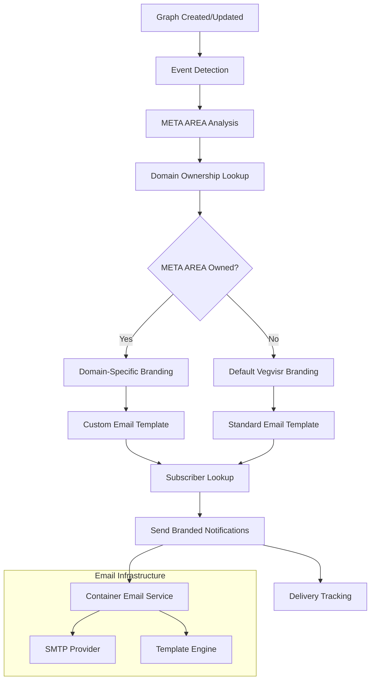

# Phase 2: Event-Driven Notification System with Email Branding Architecture

**Version:** 1.0  
**Date:** January 19, 2025  
**Author:** AI Assistant + User Collaboration  
**Status:** Design Phase

## 🎯 Executive Summary

Phase 2 transforms the subscription system from Phase 1 into a complete event-driven notification platform with domain-specific email branding. The core innovation is connecting META AREAs to custom domains, enabling branded email notifications that match each domain's visual identity and sender configuration.

## 🏗️ System Architecture Overview



## 📊 Core Components

### 1. META AREA → Domain Connection System

**Concept:** Each META AREA can be "owned" by a custom domain, determining which branding and email configuration to use for notifications.

**Examples:**

- `NORSEGONG` → norsegong.com (branded emails from Norse Gong)
- `XYZVIBE` → xyzvibe.com (branded emails from XYZ Vibe)
- `BUSINESS CANVAS` → No owner (default Vegvisr branding)

### 2. Event-Driven Notification Engine

**Triggers:**

- Graph creation with specific META AREAs
- Graph updates to existing content
- User registration events
- System-level activities (Superadmin notifications)

**Flow:**

1. Event occurs in any worker (knowledge-graph-worker, main-worker, etc.)
2. Webhook sent to notification service
3. META AREA analysis and domain lookup
4. Subscriber matching and notification generation
5. Branded email delivery

### 3. Email Branding Integration

**Domain-Specific Configuration:**

- Custom sender email addresses (notifications@yourdomain.com)
- Domain-specific email templates
- Brand colors, logos, and styling
- Custom email signatures and footers

**Template System:**

- WYSIWYG email template editor
- Variable substitution ({{graph.title}}, {{metaAreas}}, etc.)
- Live preview with actual branding
- Template inheritance and overrides

## 🗂️ Database Schema Extensions

### Meta Area Ownership Table

```sql
CREATE TABLE meta_area_domains (
    id INTEGER PRIMARY KEY AUTOINCREMENT,
    meta_area TEXT NOT NULL,
    domain TEXT NOT NULL,
    owner_email TEXT NOT NULL,
    claimed_at TIMESTAMP DEFAULT CURRENT_TIMESTAMP,
    priority INTEGER DEFAULT 1,
    status TEXT DEFAULT 'active', -- active, suspended, transferred
    UNIQUE(meta_area, domain)
);

-- Example data:
INSERT INTO meta_area_domains (meta_area, domain, owner_email) VALUES
('NORSEGONG', 'norsegong.com', 'admin@norsegong.com'),
('NORSEMYTHOLOGY', 'norsegong.com', 'admin@norsegong.com'),
('XYZVIBE', 'xyzvibe.com', 'owner@xyzvibe.com');
```

### Extended Site Configuration (KV Store)

```json
{
  "domain": "norsegong.com",
  "branding": {
    "logo": "https://cdn.example.com/norsegong-logo.png",
    "primaryColor": "#1a5490",
    "secondaryColor": "#f4f4f4",
    "companyName": "Norse Gong Knowledge"
  },
  "contentFilter": {
    "metaAreas": ["NORSEGONG", "NORSEMYTHOLOGY"]
  },
  "ownedMetaAreas": ["NORSEGONG", "NORSEMYTHOLOGY"],
  "emailConfig": {
    "senderEmail": "notifications@norsegong.com",
    "senderName": "Norse Gong Knowledge System",
    "replyTo": "support@norsegong.com",
    "templates": {
      "graph_created": {
        "subject": "New {{graph.type}}: {{graph.title}}",
        "html": "<!-- Custom HTML template -->"
      },
      "graph_updated": {
        "subject": "Updated: {{graph.title}} in {{metaAreas}}",
        "html": "<!-- Custom HTML template -->"
      },
      "weekly_digest": {
        "subject": "Your Weekly {{domain}} Knowledge Update",
        "html": "<!-- Custom HTML template -->"
      }
    },
    "smtp": {
      "provider": "sendgrid", // or "mailgun", "ses", etc.
      "apiKey": "encrypted_key_reference"
    }
  }
}
```

### User Subscriptions (Enhanced)

```json
// In config table data field:
{
  "subscriptions": [
    {
      "id": "sub_123456789",
      "subscription_type": "meta_area",
      "target_id": "NORSEGONG",
      "target_title": "NORSEGONG",
      "status": "active",
      "preferences": {
        "frequency": "immediate", // immediate, daily, weekly
        "emailEnabled": true,
        "pushEnabled": false
      },
      "unsubscribe_token": "uuid-token",
      "created_at": "2025-01-19T10:00:00Z"
    }
  ]
}
```

## 🔧 Technical Implementation

### Email Infrastructure Options

**Chosen Approach: Container-Based Email Service**

**Rationale:**

- User already comfortable with container deployment
- Full control over email logic and templates
- Can integrate with existing database easily
- Flexibility to change SMTP providers

**Architecture:**

```
Cloudflare Container (Node.js)
├── Express.js webhook endpoints
├── Email template engine (Handlebars/Mustache)
├── SMTP integration (Nodemailer)
├── Database connections (existing vegvisr_org)
└── Queue processing (optional)
```

**SMTP Provider Recommendations:**

- **SendGrid**: 100 emails/day free, excellent deliverability
- **Mailgun**: 5,000 emails/month free, good API
- **Amazon SES**: $0.10 per 1,000 emails, very reliable
- **Postmark**: 100 emails/month free, best deliverability

### Notification Service Implementation

**Container Structure:**

```
notification-service/
├── src/
│   ├── index.js              # Main Express app
│   ├── routes/
│   │   ├── webhooks.js       # Webhook endpoints
│   │   └── admin.js          # Admin management
│   ├── services/
│   │   ├── emailService.js   # Email sending logic
│   │   ├── templateService.js # Template rendering
│   │   ├── domainService.js  # META AREA → Domain lookup
│   │   └── subscriptionService.js # Subscriber management
│   ├── templates/
│   │   ├── default/          # Default email templates
│   │   └── partials/         # Reusable template components
│   └── utils/
├── Dockerfile
├── package.json
└── docker-compose.yml
```

**Core Service Logic:**

```javascript
// services/emailService.js
class EmailService {
  async sendNotification(event) {
    // 1. Analyze META AREAs
    const metaAreas = this.parseMetaAreas(event.metaAreas)

    // 2. Group by domain ownership
    const domainGroups = await this.groupByDomainOwnership(metaAreas)

    // 3. Send notifications per domain group
    for (const [domain, areas] of domainGroups) {
      const emailConfig = await this.getEmailConfig(domain)
      const subscribers = await this.getSubscribers(areas)

      await this.sendBrandedEmails(subscribers, event, emailConfig)
    }
  }

  async getEmailConfig(domain) {
    if (domain === 'default') {
      return this.defaultEmailConfig
    }

    const siteConfig = await this.getSiteConfig(domain)
    return {
      from: `"${siteConfig.emailConfig.senderName}" <${siteConfig.emailConfig.senderEmail}>`,
      templates: siteConfig.emailConfig.templates,
      branding: siteConfig.branding,
    }
  }
}
```

## 🎨 Email Template System

### Template Structure

```html
<!-- templates/graph_created.hbs -->
<!DOCTYPE html>
<html>
  <head>
    <meta charset="utf-8" />
    <title>{{subject}}</title>
    <style>
      /* Responsive email styles */
      .email-container { max-width: 600px; margin: 0 auto; font-family: Arial, sans-serif; }
      .header { background: {{branding.primaryColor}}; padding: 20px; text-align: center; }
      .content { padding: 30px; background: white; }
      .footer { background: #f8f9fa; padding: 20px; font-size: 12px; }
      .btn { background: {{branding.primaryColor}}; color: white; padding: 12px 24px; text-decoration: none; border-radius: 6px; }
    </style>
  </head>
  <body>
    <div class="email-container">
      {{> header}}

      <div class="content">
        <h2 style="color: {{branding.primaryColor}};">📊 New Knowledge Graph Created</h2>

        <div style="background: #f8f9fa; padding: 20px; border-radius: 8px; margin: 20px 0;">
          <h3>{{graph.title}}</h3>
          <p><strong>Meta Areas:</strong> {{metaAreas}}</p>
          <p><strong>Author:</strong> {{author.name}} ({{author.email}})</p>
          <p><strong>Created:</strong> {{formatDate createdAt}}</p>
        </div>

        {{#if graph.description}}
        <p>{{graph.description}}</p>
        {{/if}}

        <div style="text-align: center; margin: 30px 0;">
          <a href="{{viewUrl}}" class="btn"> View Knowledge Graph </a>
        </div>
      </div>

      {{> footer}}
    </div>
  </body>
</html>
```

### Template Variables

```javascript
const templateVariables = {
  // Graph information
  'graph.title': 'Marketing Strategy 2025',
  'graph.description': 'Comprehensive marketing approach...',
  'graph.id': 'graph_1642634567890',

  // Meta area information
  metaAreas: 'BUSINESS CANVAS, MARKETING',
  metaAreaList: ['BUSINESS CANVAS', 'MARKETING'],

  // Author information
  'author.name': 'Jane Smith',
  'author.email': 'jane@company.com',

  // URLs
  viewUrl: 'https://vegvisr.org/graph-viewer?id=graph_1642634567890',
  unsubscribeUrl: 'https://subscription-worker.com/unsubscribe?token=abc123',
  manageUrl: 'https://vegvisr.org/user',

  // Branding
  'branding.logo': 'https://cdn.norsegong.com/logo.png',
  'branding.primaryColor': '#1a5490',
  'branding.companyName': 'Norse Gong Knowledge',
  domain: 'norsegong.com',

  // Dates
  createdAt: '2025-01-19T14:30:00Z',
  formattedDate: 'January 19, 2025 at 2:30 PM',
}
```

## 🚀 Integration with Existing Systems

### BrandingModal Extensions

**New Step: META AREA Ownership**

```vue
<!-- Step 4: META AREA Claiming -->
<div v-if="currentStep === 4" class="step-content">
  <h4>🏷️ Claim META AREAs</h4>
  <p>Choose which META AREAs your domain will send notifications for:</p>

  <div class="meta-area-claiming">
    <div class="available-meta-areas mb-3">
      <div class="meta-area-grid">
        <div
          v-for="metaArea in availableMetaAreas"
          :key="metaArea"
          class="meta-area-card"
          :class="getMetaAreaStatus(metaArea)"
          @click="toggleMetaAreaClaim(metaArea)"
        >
          <div class="meta-area-name">{{ metaArea }}</div>
          <div class="claim-status">
            <span v-if="isClaimedByMe(metaArea)" class="badge bg-success">
              ✓ Owned by {{ formData.domain }}
            </span>
            <span v-else-if="isClaimedByOther(metaArea)" class="badge bg-warning">
              Owned by {{ getMetaAreaOwner(metaArea) }}
            </span>
            <span v-else class="badge bg-secondary">
              Unclaimed (Default Vegvisr Branding)
            </span>
          </div>
        </div>
      </div>
    </div>
  </div>
</div>

<!-- Step 5: Email Template Configuration -->
<div v-if="currentStep === 5" class="step-content">
  <h4>📧 Email Templates</h4>
  <EmailTemplateEditor
    v-model="formData.emailConfig"
    :branding="formData.branding"
    :owned-meta-areas="formData.ownedMetaAreas"
  />
</div>
```

### Worker Integration

**Update Existing Workers to Send Webhooks:**

```javascript
// knowledge-graph-worker/index.js - After saving graph
if (pathname === '/saveknowgraph' && request.method === 'POST') {
  // ... existing save logic ...

  if (saveResult.success) {
    // Send notification webhook
    try {
      await fetch('https://notification-service.vegvisr.org/webhook/graph-created', {
        method: 'POST',
        headers: { 'Content-Type': 'application/json' },
        body: JSON.stringify({
          event: 'graph_created',
          graphId: graph.id,
          title: graph.title,
          metaAreas: graph.metadata.metaArea,
          authorEmail: userEmail,
          authorName: userDisplayName,
          createdAt: new Date().toISOString(),
          description: graph.description,
        }),
      })
    } catch (error) {
      console.warn('Failed to send notification webhook:', error)
      // Don't fail the main operation if notifications fail
    }
  }
}
```

## 📋 Implementation Phases

### Phase 2A: Core Infrastructure (Week 1-2)

- [ ] Create notification service container
- [ ] Implement META AREA → Domain mapping system
- [ ] Add basic webhook endpoints
- [ ] Set up email service integration (SendGrid/Mailgun)
- [ ] Create default email templates

### Phase 2B: Branding Integration (Week 3-4)

- [ ] Extend BrandingModal with META AREA claiming
- [ ] Add EmailTemplateEditor component
- [ ] Implement template rendering engine
- [ ] Create branded email preview system
- [ ] Add email config to site configuration

### Phase 2C: Event Integration (Week 5-6)

- [ ] Add webhook calls to existing workers
- [ ] Implement subscriber matching logic
- [ ] Create notification queue processing
- [ ] Add delivery tracking and analytics
- [ ] Test end-to-end notification flow

### Phase 2D: Admin Features (Week 7-8)

- [ ] META AREA ownership management dashboard
- [ ] Email template library and sharing
- [ ] Notification analytics and reporting
- [ ] Bulk notification tools for Superadmins
- [ ] A/B testing for email templates

## 🔒 Security Considerations

### Email Security

- DKIM/SPF configuration for custom domains
- Encrypted API key storage
- Rate limiting for webhook endpoints
- Email content sanitization
- Unsubscribe token security

### Access Control

- Superadmin-only META AREA management
- Domain ownership verification
- Template modification permissions
- Webhook endpoint authentication
- Audit logging for email campaigns

## 📊 Monitoring & Analytics

### Email Metrics

- Delivery rates per domain
- Open rates by META AREA
- Click-through rates for graph views
- Bounce and complaint tracking
- Template performance comparison

### System Metrics

- Webhook processing times
- Queue depth and processing rates
- Database query performance
- Email service API response times
- Error rates by component

## 🚀 Deployment Architecture

```yaml
# docker-compose.yml
version: '3.8'
services:
  notification-service:
    build: .
    ports:
      - '3000:3000'
    environment:
      - DATABASE_URL=${VEGVISR_DATABASE_URL}
      - SENDGRID_API_KEY=${SENDGRID_API_KEY}
      - KV_NAMESPACE_ID=${SITE_CONFIGS_KV}
      - WEBHOOK_SECRET=${NOTIFICATION_WEBHOOK_SECRET}
    volumes:
      - ./templates:/app/templates
    restart: unless-stopped

  redis:
    image: redis:alpine
    ports:
      - '6379:6379'
    restart: unless-stopped
```

## 🎯 Expected Outcomes

### For Domain Owners

- Professional branded email notifications
- Complete control over email appearance and sender identity
- Consistent brand experience across website and emails
- Analytics on subscriber engagement

### For Subscribers

- Relevant, branded notifications from content sources
- Clear visual connection between website and emails
- Professional communication experience
- Easy subscription management

### For Vegvisr Platform

- Scalable notification infrastructure
- Reduced generic "vegvisr.org" emails
- Better email deliverability through domain-specific sending
- Enhanced value proposition for custom domain users

## 📈 Success Metrics

- **Engagement**: Email open rates >25%, click rates >5%
- **Deliverability**: <2% bounce rate, <0.1% spam complaints
- **Adoption**: >80% of custom domains configure email branding
- **Performance**: <2 second notification processing time
- **User Satisfaction**: >4.5/5 rating for email experience

---

**Next Steps:** Approve architecture and begin Phase 2A implementation with container service setup and basic email infrastructure.
