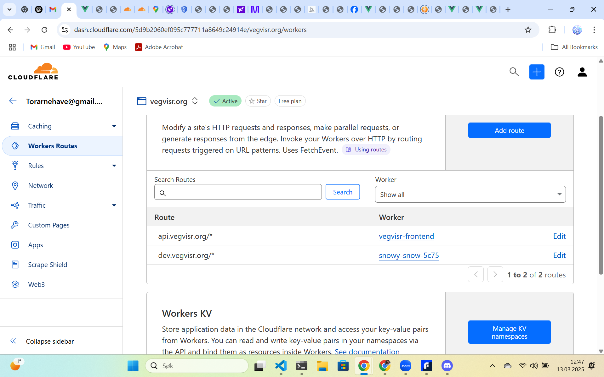
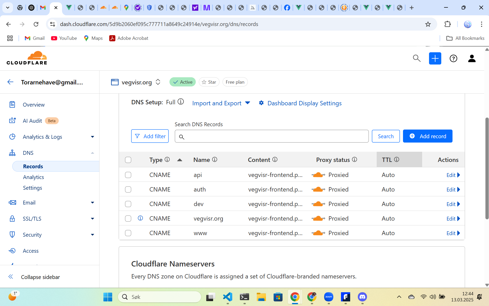

# Guide to Deploy Cloudflare Worker and Connect to Vue.js App

## Step 1: Ensure Wrangler is Installed and Updated

First, make sure that **Wrangler** is installed and up-to-date. If you're seeing warnings about the version, update it as follows:

```bash
npm install --save-dev wrangler@latest
```

## Step 2: Create or Edit `wrangler.toml` File

In your Cloudflare Worker directory (`dev-worker` in this case), you should have a `wrangler.toml` file. This file contains the configuration for your Cloudflare Worker.

Example `wrangler.toml`:

```toml
name = "vegvisr-worker"
type = "javascript"

account_id = "your-cloudflare-account-id"
workers_dev = true
compatibility_date = "2025-03-13"

[env.production]
route = "https://dev.vegvisr.org/*"
zone_id = "your-cloudflare-zone-id"
```

Ensure that the `account_id` and `zone_id` are correctly filled in with your Cloudflare account information.

## Step 3: Cloudflare Worker Code

In your worker directory (`dev-worker`), create or edit a file (e.g., `index.js` or `worker.js`) with the Cloudflare Worker code. Here's an example worker that returns a JSON response with a message:

```javascript
export default {
  async fetch() {
    try {
      // Create a JSON object to send back
      const data = { message: 'Hello World XXXX!' }

      // Return a JSON response with CORS header and proper content type
      const response = new Response(JSON.stringify(data), {
        headers: {
          'Content-Type': 'application/json', // Set Content-Type to JSON
          'Access-Control-Allow-Origin': '*', // Allow CORS
        },
      })

      return response
    } catch (error) {
      return new Response('Error: ' + error.message, { status: 500 })
    }
  },
}
```

## Step 4: Run the Command to Deploy

Once the `wrangler.toml` is set up and the worker code is in place, use the following command to deploy your Cloudflare Worker:

```bash
npx wrangler deploy --config dev-worker/wrangler.toml
```

- **`npx wrangler deploy`**: This command deploys your worker to Cloudflare.
- **`--config dev-worker/wrangler.toml`**: This specifies the path to your `wrangler.toml` file.

## Step 5: Verify Deployment

After running the command, you should see a confirmation message in your terminal about the deployment, including the URL where your worker is live.

## Step 6: Update Vue.js App to Call the Cloudflare Worker

In your Vue.js app, you can now make a `fetch` call to your worker’s endpoint (e.g., `https://dev.vegvisr.org`). Here's how you can modify the Vue component to handle this request:

```vue
<template>
  <div>
    <h1>API Data</h1>
    <button @click="fetchData">Fetch Data</button>

    <div v-if="loading">Loading...</div>
    <div v-if="error" class="error">
      <p>Error fetching data: {{ error }}</p>
    </div>
    <div v-if="data">
      <pre>{{ data }}</pre>
    </div>
  </div>
</template>

<script>
import axios from 'axios'

export default {
  data() {
    return {
      data: null,
      loading: false,
      error: null,
    }
  },
  methods: {
    async fetchData() {
      this.loading = true
      this.error = null // Reset the error before each fetch

      try {
        const response = await axios.get('https://dev.vegvisr.org') // Worker URL

        this.data = response.data // This will now be a JSON object from the worker
      } catch (error) {
        console.error('Error details:', error) // Log the error details
        if (error.response) {
          this.error = `Server responded with status ${error.response.status}: ${error.response.data}`
        } else if (error.request) {
          this.error = 'No response received from the server'
        } else {
          this.error = `Error in setting up request: ${error.message}`
        }
      } finally {
        this.loading = false // Hide loading spinner when done
      }
    },
  },
}
</script>

<style scoped>
.error {
  color: red;
}
</style>
```

## Step 7: Test the Vue.js App

After deploying your worker, you should be able to call the worker's endpoint from your Vue.js app. The `Fetch Data` button will trigger the `fetchData` method, which calls your worker at `https://dev.vegvisr.org` and displays the data in your Vue.js component.

## Step 8: Set Up DNS Records for Cloudflare Worker



To point `dev.vegvisr.org` to `vegvisr-frontend.pages.dev` (the target for your worker), you’ll need to configure a CNAME record for the subdomain `dev` in your Cloudflare DNS settings.

**Steps to Add DNS Records for Your Worker:**

1. **Log in to Cloudflare** and go to the **DNS** settings for `vegvisr.org`.
2. **Add or Edit CNAME Record for `dev` Subdomain**:

   - Set the **Type** to **CNAME**.
   - In the **Name** field, enter `dev`.
   - In the **Content** field, enter `vegvisr-frontend.pages.dev`.
   - Ensure the **Proxy status** is set to **Proxied** (the orange cloud).

   Example configuration:

   - **Type**: `CNAME`
   - **Name**: `dev`
   - **Content**: `vegvisr-frontend.pages.dev`
   - **Proxy status**: **Proxied** (orange cloud)

3. **Save the Record**: After configuring the record, save it.
4. **Test DNS Propagation**: DNS changes may take a few minutes to propagate.

## Step 9: Configure Worker Routes in Cloudflare



To ensure that the correct subdomains are routed to your Cloudflare Worker, you need to configure worker routes for the relevant paths (e.g., `dev.vegvisr.org`).

**Steps to Configure Worker Routes:**

1. **Log in to Cloudflare** and go to the **Workers Routes** section.
2. **Add Worker Routes**:
   - For **`dev.vegvisr.org`**, make sure it routes to your Cloudflare Worker (`vegvisr-frontend`).
   - For example, set `dev.vegvisr.org/*` as the route.
3. **Verify the Routes**: Ensure the routes are correctly mapped to the respective workers, like `dev.vegvisr.org/*` -> `vegvisr-frontend`.
4. **Save the Route**: After configuring the routes, save your changes.

## Step 10: Test Everything

Once you've configured your DNS records, worker routes, and deployed the worker:

1. **Test in a Browser**: Open your browser and navigate to `https://dev.vegvisr.org`. If everything is configured correctly, you should see the response from your Cloudflare Worker.
2. **Verify Using Developer Tools**: You can open the browser’s developer tools (usually by pressing `F12`), go to the **Network** tab, and refresh the page to see the details of the request and response.

---

### **Final Notes**

- **CORS**: Ensure that CORS headers are set in your worker if you are accessing it from different domains.
- **DNS Propagation**: DNS changes may take some time to propagate, so if the worker doesn't respond immediately, try again after a few minutes.

By following these steps, your Cloudflare Worker should be deployed correctly, and your Vue.js app should be able to fetch data from it. Let me know if you need further assistance with this setup!
