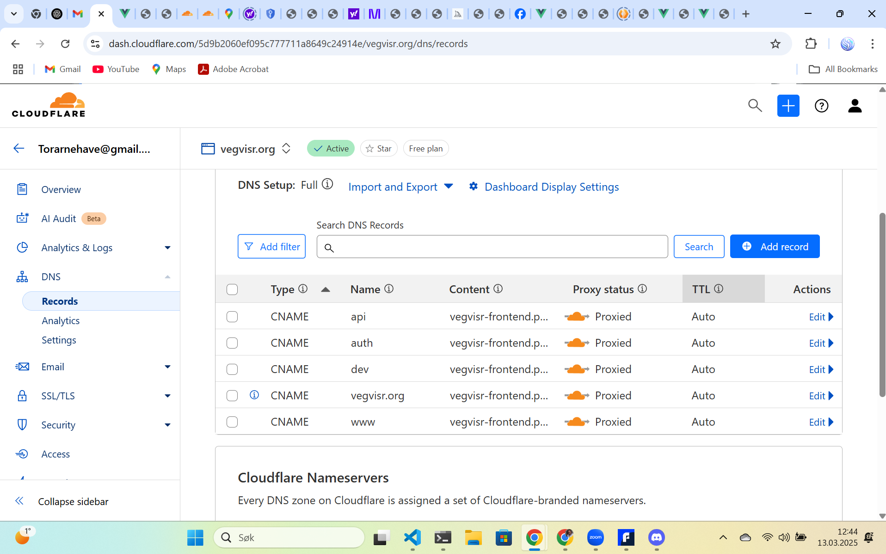
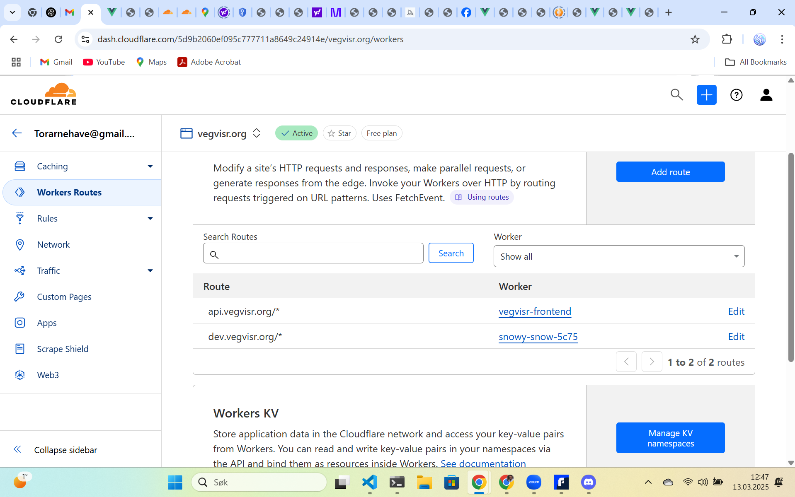

# Guide to Deploy Cloudflare Worker and Connect to Vue.js App

## Step 1: Ensure Wrangler is Installed and Updated

First, make sure that **Wrangler** is installed and up-to-date. If you're seeing warnings about the version, update it as follows:

```bash
npm install --save-dev wrangler@latest

```

Here is a step to explain the necessary **NPM packages** and what they do in the context of your project:

---

## Step 11: NPM Packages and Their Functions

In order to set up your project, the following NPM packages are installed. Below is a breakdown of each package and its purpose:

### **1. `@eslint/js@9.22.0`**

- **Purpose**: This is the core ESLint package for linting JavaScript. It provides the rules and environment for linting your JavaScript code to ensure it adheres to best practices and style guidelines.

### **2. `@jridgewell/sourcemap-codec@1.5.0`**

- **Purpose**: This package is a utility to handle sourcemaps, which are used for debugging purposes. It helps decode and encode sourcemaps, ensuring that errors in your code are correctly mapped back to their source.

### **3. `@rollup/plugin-inject@5.0.5`**

- **Purpose**: This Rollup plugin automatically injects modules into your code when bundling. It is useful for injecting commonly used modules (like `Vue` or `React`) into your bundle without needing to import them explicitly in every file.

### **4. `@vitejs/plugin-vue@5.2.1`**

- **Purpose**: This plugin enables Vue.js support in Vite, a build tool that provides fast and optimized development and production environments for modern web projects. This plugin allows Vite to handle `.vue` single-file components.

### **5. `@vue/eslint-config-prettier@10.2.0`**

- **Purpose**: This is an ESLint configuration package that integrates with Prettier, a code formatter. It ensures that ESLint rules don’t conflict with Prettier formatting rules.

### **6. `axios@1.8.3`**

- **Purpose**: Axios is a promise-based HTTP client for making requests from the browser or Node.js. It simplifies the process of making API calls and handling responses, and supports features like interceptors, cancellation, and more.

```bash
import axios from 'axios'

export default {
  data() {
    return {
      data: null,
      loading: false,
      error: null,
    }
  },
  methods: {
    async fetchData() {
      this.loading = true
      this.error = null // Reset the error before each fetch

      try {
        const response = await axios.get('https://dev.vegvisr.org')


```

### **7. `concurrently@9.1.2`**

- **Purpose**: This package allows you to run multiple NPM scripts concurrently. It’s useful for running tasks like building your app and running the development server simultaneously.

```bash
"scripts": {
  "dev:vue": "vite",
  "dev:m-worker": "wrangler dev --config main-worker/wrangler.toml --port=8787",
  "dev:d-worker": "wrangler dev --config dev-worker/wrangler.toml --port=8788",
  "dev": "concurrently \"npm run dev:vue\" \"npm run dev:m-worker\" \"npm run dev:d-worker\"",
  "build": "vite build",
  "preview": "vite preview",
  "lint": "eslint . --fix",
  "format": "prettier --write src/"
},

```

### **8. `eslint-plugin-vue@10.0.0`**

- **Purpose**: This is an ESLint plugin that provides linting rules specifically for Vue.js applications. It ensures your Vue components and files follow best practices and adhere to a consistent style.

### **9. `eslint@9.22.0`**

- **Purpose**: ESLint is a popular linting tool for JavaScript. It helps identify and fix problems in your JavaScript code, enforcing style rules and ensuring code quality.

### **10. `globals@16.0.0`**

- **Purpose**: This package defines global variables for the environment (e.g., `window`, `document`, etc.) in JavaScript. It is often used by linting tools like ESLint to avoid warning about undefined variables that are global.

### **11. `hono@4.7.4`**

```bash
import { Hono } from 'hono'

const app = new Hono()

// Endpoint: /hello
// Returns the value of the "prompt" query parameter, or a default message.
app.get('/hello', (c) => {
  const prompt = c.req.query('prompt') || 'Hello from Worker!'
  return c.json({ message: prompt })
})

// Endpoint: /greet
// Returns a personalized greeting based on the "name" query parameter.
app.get('/greet', (c) => {
  const name = c.req.query('name') || 'Guest'
  return c.json({ greeting: `Greetings, ${name}!` })
})

// Endpoint: /default
// Returns a fixed default message.
app.get('/default', (c) => {
  return c.json({ message: 'This is the default endpoint.' })
})

```

- **Purpose**: Hono is a minimalistic web framework for building fast and efficient APIs. It is lightweight and works well with Cloudflare Workers and other edge environments.

### **12. `prettier@3.5.3`**

- **Purpose**: Prettier is a code formatter that automatically formats your code to ensure consistent style. It

ensures your code follows a consistent style without having to manually format it. Prettier can automatically format JavaScript, CSS, HTML, JSON, and more.

### **13. `vite-plugin-vue-devtools@7.7.2`**

- **Purpose**: This Vite plugin integrates Vue.js Devtools into your Vite development environment. It allows you to inspect and debug your Vue components easily during development.

### **14. `vite@6.2.1`**

- **Purpose**: Vite is a modern build tool that provides fast development and optimized production builds. It significantly improves the development experience with features like hot module replacement (HMR) and fast build times.

### **15. `vue-router@4.5.0`**

- **Purpose**: Vue Router is the official routing library for Vue.js. It allows you to manage navigation and page state in your Vue.js app, enabling features like dynamic routing, lazy loading, and more.

### **16. `vue@3.5.13`**

- **Purpose**: Vue.js is the JavaScript framework used for building user interfaces. Version 3 introduces the Composition API, providing more flexibility and better organization of your Vue components.

### **17. `wrangler@4.0.0`**

- **Purpose**: Wrangler is the CLI tool for interacting with Cloudflare Workers. It helps you manage and deploy Cloudflare Workers and associated resources like routes, secrets, and KV storage. With Wrangler, you can push your worker code to Cloudflare and manage deployments.

```bash
npx wrangler deploy --config dev-worker/wrangler.toml

```

---

By installing and using these packages, you ensure that your project has the necessary tools for:

- **Linting and formatting**: `eslint`, `prettier`, and the associated plugins keep your code clean and consistent.
- **Vue development**: `vue`, `vue-router`, `@vitejs/plugin-vue`, and `vite` provide a powerful development and build environment for your Vue.js app.
- **API calls**: `axios` makes it easy to communicate with external APIs, like your Cloudflare Worker.
- **Cloudflare Worker deployment**: `wrangler` is the tool used to deploy and manage your Cloudflare Worker.

These dependencies help to streamline development and ensure that your code adheres to best practices. Let me know if you need any further clarification!

## Step 2: Create or Edit `wrangler.toml` File

In your Cloudflare Worker directory (`dev-worker` in this case), you should have a `wrangler.toml` file. This file contains the configuration for your Cloudflare Worker.

Example `wrangler.toml`:

```toml
name = "vegvisr-worker"
type = "javascript"

account_id = "your-cloudflare-account-id"
workers_dev = true
compatibility_date = "2025-03-13"

[env.production]
route = "https://dev.vegvisr.org/*"
zone_id = "your-cloudflare-zone-id"
```

Ensure that the `account_id` and `zone_id` are correctly filled in with your Cloudflare account information.

## Step 3: Cloudflare Worker Code

In your worker directory (`dev-worker`), create or edit a file (e.g., `index.js` or `worker.js`) with the Cloudflare Worker code. Here's an example worker that returns a JSON response with a message:

```javascript
export default {
  async fetch() {
    try {
      // Create a JSON object to send back
      const data = { message: 'Hello World XXXX!' }

      // Return a JSON response with CORS header and proper content type
      const response = new Response(JSON.stringify(data), {
        headers: {
          'Content-Type': 'application/json', // Set Content-Type to JSON
          'Access-Control-Allow-Origin': '*', // Allow CORS
        },
      })

      return response
    } catch (error) {
      return new Response('Error: ' + error.message, { status: 500 })
    }
  },
}
```

## Step 4: Run the Command to Deploy

Once the `wrangler.toml` is set up and the worker code is in place, use the following command to deploy your Cloudflare Worker:

```bash
npx wrangler deploy --config dev-worker/wrangler.toml
```

- **`npx wrangler deploy`**: This command deploys your worker to Cloudflare.
- **`--config dev-worker/wrangler.toml`**: This specifies the path to your `wrangler.toml` file.

## Step 5: Verify Deployment

After running the command, you should see a confirmation message in your terminal about the deployment, including the URL where your worker is live.

## Step 6: Update Vue.js App to Call the Cloudflare Worker

In your Vue.js app, you can now make a `fetch` call to your worker’s endpoint (e.g., `https://dev.vegvisr.org`). Here's how you can modify the Vue component to handle this request:

```vue
<template>
  <div>
    <h1>API Data</h1>
    <button @click="fetchData">Fetch Data</button>

    <div v-if="loading">Loading...</div>
    <div v-if="error" class="error">
      <p>Error fetching data: {{ error }}</p>
    </div>
    <div v-if="data">
      <pre>{{ data }}</pre>
    </div>
  </div>
</template>

<script>
import axios from 'axios'

export default {
  data() {
    return {
      data: null,
      loading: false,
      error: null,
    }
  },
  methods: {
    async fetchData() {
      this.loading = true
      this.error = null // Reset the error before each fetch

      try {
        const response = await axios.get('https://dev.vegvisr.org') // Worker URL

        this.data = response.data // This will now be a JSON object from the worker
      } catch (error) {
        console.error('Error details:', error) // Log the error details
        if (error.response) {
          this.error = `Server responded with status ${error.response.status}: ${error.response.data}`
        } else if (error.request) {
          this.error = 'No response received from the server'
        } else {
          this.error = `Error in setting up request: ${error.message}`
        }
      } finally {
        this.loading = false // Hide loading spinner when done
      }
    },
  },
}
</script>

<style scoped>
.error {
  color: red;
}
</style>
```

## Step 7: Set Up DNS Records for Cloudflare Worker



To point `dev.vegvisr.org` to `vegvisr-frontend.pages.dev` (the target for your worker), you’ll need to configure a CNAME record for the subdomain `dev` in your Cloudflare DNS settings.

**Steps to Add DNS Records for Your Worker:**

1. **Log in to Cloudflare** and go to the **DNS** settings for `vegvisr.org`.
2. **Add or Edit CNAME Record for `dev` Subdomain**:

   - Set the **Type** to **CNAME**.
   - In the **Name** field, enter `dev`.
   - In the **Content** field, enter `vegvisr-frontend.pages.dev`.
   - Ensure the **Proxy status** is set to **Proxied** (the orange cloud).

   Example configuration:

   - **Type**: `CNAME`
   - **Name**: `dev`
   - **Content**: `vegvisr-frontend.pages.dev`
   - **Proxy status**: **Proxied** (orange cloud)

3. **Save the Record**: After configuring the record, save it.
4. **Test DNS Propagation**: DNS changes may take a few minutes to propagate.

## Step 8: Configure Worker Routes in Cloudflare



To ensure that the correct subdomains are routed to your Cloudflare Worker, you need to configure worker routes for the relevant paths (e.g., `dev.vegvisr.org`).

**Steps to Configure Worker Routes:**

1. **Log in to Cloudflare** and go to the **Workers Routes** section.
2. **Add Worker Routes**:
   - For **`dev.vegvisr.org`**, make sure it routes to your Cloudflare Worker (`vegvisr-frontend`).
   - For example, set `dev.vegvisr.org/*` as the route.
3. **Verify the Routes**: Ensure the routes are correctly mapped to the respective workers, like `dev.vegvisr.org/*` -> `vegvisr-frontend`.
4. **Save the Route**: After configuring the routes, save your changes.

## Step 9: Test Everything

Once you've configured your DNS records, worker routes, and deployed the worker:

1. **Test in a Browser**: Open your browser and navigate to `https://dev.vegvisr.org`. If everything is configured correctly, you should see the response from your Cloudflare Worker.
2. **Verify Using Developer Tools**: You can open the browser’s developer tools (usually by pressing `F12`), go to the **Network** tab, and refresh the page to see the details of the request and response.

---

## Step 10: Test the Vue.js App

After deploying your worker, you should be able to call the worker's endpoint from your Vue.js app. The `Fetch Data` button will trigger the `fetchData` method, which calls your worker at `https://dev.vegvisr.org` and displays the data in your Vue.js component.

### **Final Notes**

- **CORS**: Ensure that CORS headers are set in your worker if you are accessing it from different domains.
- **DNS Propagation**: DNS changes may take some time to propagate, so if the worker doesn't respond immediately, try again after a few minutes.

By following these steps, your Cloudflare Worker should be deployed correctly, and your Vue.js app should be able to fetch data from it. Let me know if you need further assistance with this setup!
